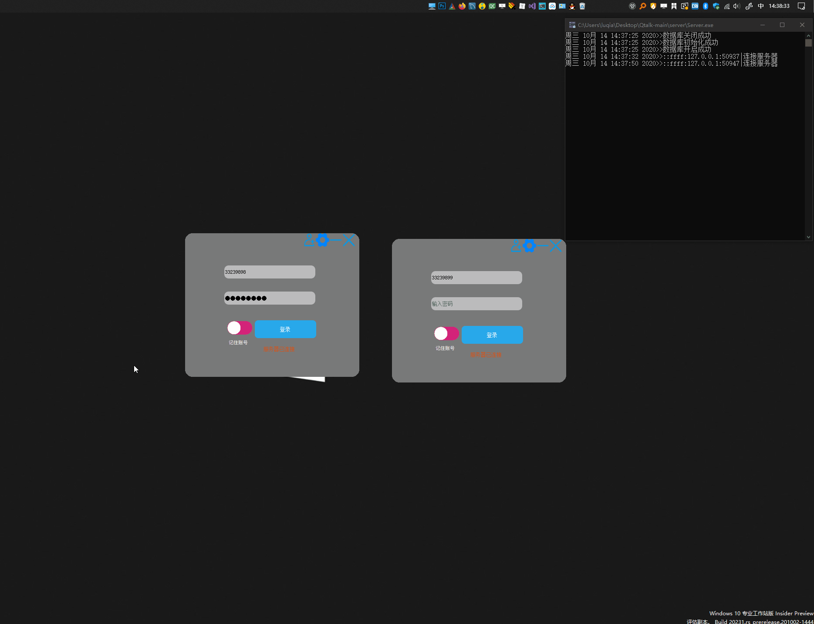

## Qtalk功能简介
#### 快速演示

## 软件介绍
   Qtalk是一个基于Qt的局域网聊天软件，支持用户注册功能，密码加密，一对一聊天，记住账号，上传头像等功能。此软件用到了Qt 的基础容器（list map），网络功能，数据库功能，json,ini，图像，文件操作等功能，比较适合小白练手，快速掌握Qt的各个功能以及怎样构建一个小项目。

### 使用说明

代码仓里的client和server文件夹中有对应的编译好的exe直接运行即可，如果提示缺少XXX的，文件夹了的vc_redist.x64.exe安装一下就行了，第一次运行点击右上角的齿轮按钮配置服务器，默认端口号为12345，ip为服务器程序运行的电脑的局域网ip，配置好后需要关闭软件再重新打开（这是个bug，以后修复后不用重启了就）

# [代码GitHub链接](https://github.com/IQ-Director/Qtalk.git)

